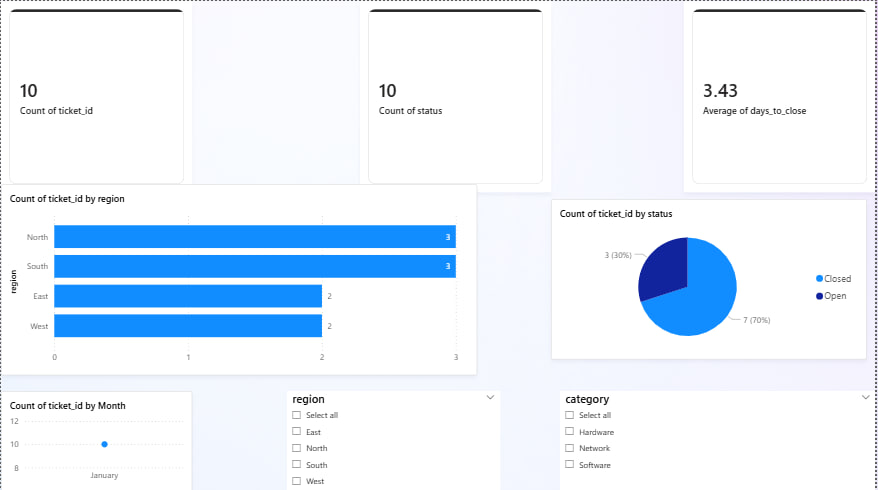

# Service Operations KPI Dashboard
**Tools:** Power BI | Python (Pandas) | Excel

## Overview
An interactive Power BI dashboard designed to track service operation KPIs, simulating a real-world service team environment. Covers ticket lifecycle, downtime events, and billing status.

## Features
- Ticket response and closure timeline tracking (opened within 24hrs, closed within 7 days)
- DAX calculated measures and time-intelligence line graphs
- Slicers and filters for drill-down by region, ticket category, and time period
- Python data cleaning pipeline for raw CSV exports
- Excel summary with pivot tables and conditional formatting

## Dashboard Preview

## How to Run the Python Script
1. Install dependencies: `pip install pandas`
2. Run: `python scripts/data_cleaning.py`

